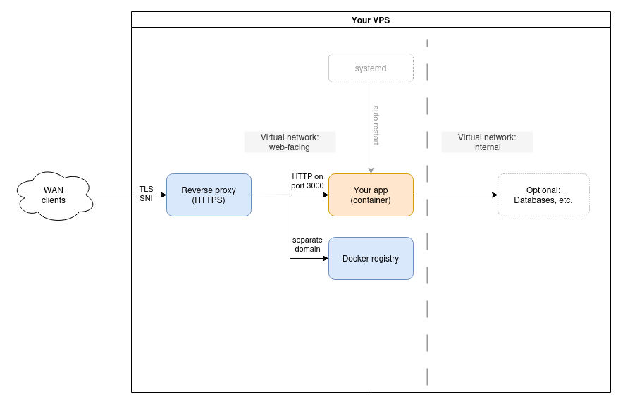

# Self-host your app on a VPS!

> I just made an app.  
> Even has a Dockerfile.  
> How do I host it?

-- developer's haiku

This project lets you run a containerized application on a cheap Virtual Private Server (VPS). It automates the set-up and maintenance of the app instance and its supporting services like databases.

Features:

[HTTPS reverse proxy](#base) | [Docker image registry](#docker-image-registry) | [App deployment](#app-deployment) | [PostgreSQL](#postgresql) | [Redis](#redis) | [Automatic daily backup](#backup) | [Security updates](#security-updates)

**This is a work in progress. It works, but I'm still polishing some stuff around the edges.**



## Operating system support

For now, the only tested server operating system is **Ubuntu 24.04 LTS**.  

This has also been tested with Debian GNU/Linux 12 (bookworm) as the client, but it requires a newer Ansible version - the version from the bookworm repo uses deprecated Python 3 features which are gone in Ubuntu 24.04's Python 3.12 (see [solution](#common-problems-and-their-solutions)).

## Install
First, clone or download this repository:

```sh
git clone https://github.com/rkaw92/vpslite.git
```

---

If **Ansible** is not installed, you need to install it now.
<details>
    <summary>Click to show Ansible install instructions</summary>

```sh
pipx install --include-deps ansible
# Optionally for development:
pipx inject --include-apps ansible ansible-lint
```

</details>

---

Get the additional required modules from Ansible Galaxy:
```sh
cd vpslite/ansible
ansible-galaxy install -r roles/requirements.yml
```

### Configuration files

The various functionalities provided by this tool are shipped in the form of Ansible **playbooks**.  
Each playbook ships with an example configuration file to be placed in `group_vars/all/*_vars`:

```sh
cp inventory.example inventory
cp -r group_vars.example group_vars
```

### Point to your VPS

Edit the file:
* `inventory`

Change the example IP address to your VPS' IP or DNS hostname.
Before running any playbook, make sure you can connect:
```sh
ssh username@<your_vps_host>
```

Do this at least once to avoid being asked about SSH host key verification.

## Modules

### Base

**This module must be run before anything else.**

Installs and configures the basics:
* `podman` (for container hosting)
* `unattended-upgrades` (for keeping the system up-to-date)
* `Caddy` (the HTTPS reverse proxy component, runs in Podman already)

```sh
ansible-playbook base.yaml
```

If all goes well, a reverse proxy server should be started. It does not serve any domains yet, because it has not been configured with a domain name. This is done in other playbooks as needed.

To check the proxy status:

```sh
# On the target server:
systemctl status vpslite-caddy.service
```

To see running containers:

```sh
podman ps
```

Note: if you stop a container using `podman stop`, it will be re-created by systemd based on the unit file.  
To manage container lifecycle, use `systemctl stop/start/restart <unitname>`  
To disable/enable a container, use `systemctl disable/enable <unitname>`

---

### Docker image registry

Prerequisites:
* DNS A record (**domain name**) that points to your VPS
    * Has to be different from the app hosting domain (similar to how GitHub uses ghcr.io instead of github.com)
    * It can be a subdomain - for example, this works: `registry.example.com`

Edit the configuration file according to comments:
* `group_vars/all/registry_vars`

Run:

```sh
ansible-playbook registry.yaml
```

#### Use the container registry

On your client machine, you should now be able to do:

```sh
docker login <myrepositorydomain>
```

* Username: `dev`
* Password: `(the password that you set in registry_vars)`

#### Build an app image and upload to your custom registry

```sh
docker build . -t <myrepositorydomain>/<myimage>:latest
docker push <myrepositorydomain>/<myimage>:latest
```

The application must run HTTP on port 3000. Additionally, the Dockerfile should include an EXPOSE statement for the port. This is where the reverse proxy will connect.

For an example Dockerfile that can be used for building a working Node.js app, see the directory `app-example`.

---

### App deployment

Prerequisites:
* DNS A record (**domain name**) that points to your VPS
    * Has to be different from the [image registry](#docker-image-registry) domain name
    * It may be a subdomain - both `example.com` and `app.example.com` can work

Edit the configuration file according to comments:
* `group_vars/all/app_vars`

Use the fully-qualified image name, like in the example that's already in the file.

Run:

```sh
ansible-playbook app.yaml
```

#### App status check

```sh
systemctl status vpslite-app@1.service
```

#### App logs
See: [Logs](#logs)

#### Scaling

Horizontal scaling (within the VPS host) can be done using systemd unit instances. This allows more than one of a given unit file to run.

Each app instance gets its own IP address on the virtualized network. The virtual DNS server resolves the name `app` to as many "A" records as there are app instances.

**Temporary scaling (forgotten on reboot):**

```sh
# To start 2 new instances - brings the total number to 3 from default:
systemctl start vpslite-app@2.service
systemctl start vpslite-app@3.service
```

---

**Permanent scaling:**
```sh
editor /etc/systemd/system/vpslite-app.target
```

Edit this line:

```
Requires=vpslite-app@1.service vpslite-app@2.service vpslite-app@3.service
```

Run:

```sh
systemctl daemon-reload
systemctl start vpslite-app.target
```

Note: this will not stop running app instances.  
To scale down, run: `systemctl stop vpslite-app@<number>.service`

---


### PostgreSQL

Edit (set the superuser password):
* `group_vars/all/postgres_vars`

Run:
```sh
ansible-playbook postgres.yaml
```

Now, any container with access to the infra network (for example the `app` container) should be able to resolve the database host by the DNS name `postgres`.

### Enter psql

```sh
podman exec -it vpslite-postgres psql
```

#### Configuration

You can edit the Postgres config file: `/srv/volumes/postgres-config/postgresql.conf`

#### Backup: postgres

This database includes backup hooks. It produces:
* one item per database - so that each database is backed up separately
* plus one "GLOBAL" item with roles and other objects that don't belong to any database

Restores are on-line and destructive (drops and re-creates the restored DB).  
For example, this:

```sh
cd /srv/backup
./restore.sh s3://<mybackups>/vpslite-backup/backup_postgres_mydb.zst postgres mydb
```

will completely DROP and CREATE DATABASE `mydb`.  
Also note that the last argument to restore does not matter for the postgres provider - the target database name is baked into the backup file, so you cannot dump `db1` and restore as `db2`.

### Redis

Run:

```sh
ansible-playbook redis.yaml
```

Redis is now available to other containers, including your application container, under the DNS name `redis`.

#### Configuration

To reconfigure your redis server, edit `/srv/volumes/redis-config/redis.conf` and run

```sh
systemctl restart vpslite-redis.service
```

#### Backup: redis

This database includes backup hooks. It produces one backupable item, `dump`, based on the RDB file of complete DB contents. An Append-Only File is not used.

Restoring the database requires a restart to replace the dump file with the version from backup.

---

### Backup

This deployment tool includes a simple modular backup/restore tool that ships files to AWS S3 or a compatible storage service such as Backblaze B2.

Each module can install a hook in `/srv/backup.d` that defines a **provider**.  
Each backup provider can produce one or more backupable **items**, which can be restored individually.  
For example, if you use an RDBMS, then each database would be backed up independently.

To use it, you need:
* An account with an S3-compatible object storage provider
* A storage bucket
* An access key with read/write privileges to the bucket

Edit the configuration:
* `group_vars/all/backup_vars`

Deploy automatic backup:
```sh
ansible-playbook backup.yaml
```

#### Inspect backup state

To check the timer ("cron") status:

```sh
systemctl status vpslite-backup.timer
```

The backup script produces a TSV report file each time it runs (like CSV, but tab-separated). To read it:
```sh
column -t /srv/backup/lastbackup.report.tsv
```

The last column is the exit code of the backup process. It should always be zero!

#### Restore

To list backup files:
```sh
aws --profile=vpslite s3 ls s3://<mybucket>/vpslite-backup/
```

To restore a given item using provider-specific logic:
```sh
cd /srv/backup
./restore.sh s3://<mybucket>/vpslite-backup/backup_<provider>_<item>.zst <provider> <item>
```

For example, if you're restoring a Redis database, the database will be stopped, the dump file replaced, and then Redis server is started back again.

## Ongoing maintenance

### Security updates

* Host system: the base playbook installs and enables `unattended-upgrades`, so your operating system will fetch and install the latest packages.
* Infrastructure containers: all containers are auto-updated every day to the latest version of their tag using `podman auto-update`. Image tags are configured in `const/versions.yaml` at deployment time.
* Your app container: this is [your own responsibility](#application-updates).


### Application updates

```sh
podman pull <myappimage>
systemctl restart vpslite-app@1
```

### Logs

Log collection and rotation is done by journald by default:

```sh
journalctl -u vpslite-app@1.service
```

For log rotation options, see https://www.freedesktop.org/software/systemd/man/latest/journald.conf.html - specifically `SystemMaxUse` (and `MaxRetentionSec` if you need to configure a retention policy).

## Troubleshooting

### Common problems and their solutions

#### Problem: old Ansible (<8.0) on client, Python 2.12+ on server
**Symptom**: while running some playbooks that rely on ansible.builtin.get_url, you get this error:
```
An unknown error occurred: HTTPSConnection.__init__() got an unexpected keyword argument 'cert_file'
```

**Solution**: Install newest Ansible on the client:
```sh
pipx install --include-deps ansible
# Optionally for development:
pipx inject --include-apps ansible ansible-lint
```

## License
MIT
